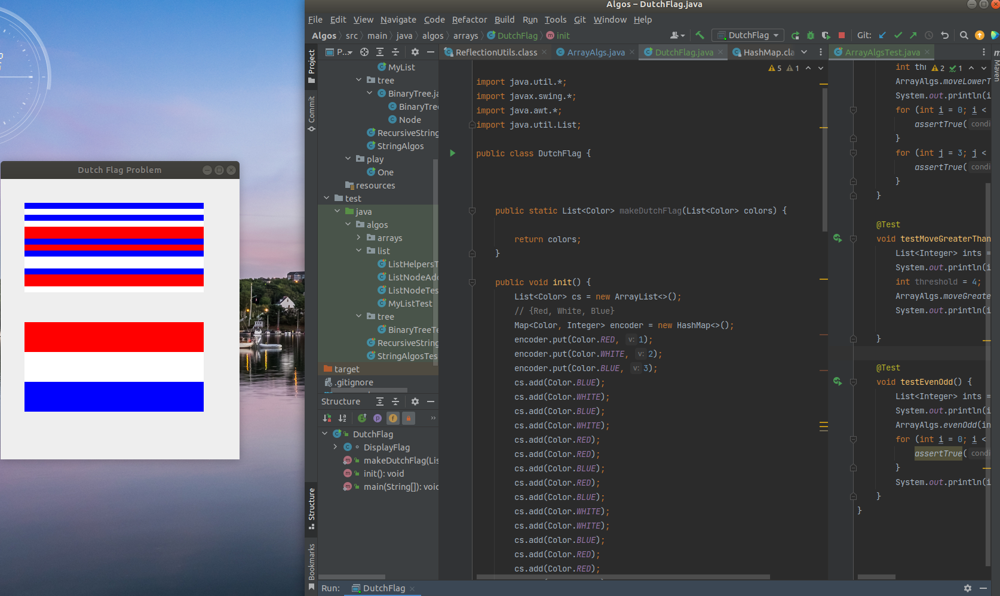

# algos
#### These algorithms came from- 
<ul>
  <li>the book- Elements of Programming-Java</li>
  <li>Udemy Course @ <a href="https://www.udemy.com/course/algorithmic-problems-in-java/learn/lecture/6707530?start=0#content" target="_blank" rel="noopener noreferrer">Udemy Course-dynamic programming, recursion</a>
  <li><a href="https://www.coursera.org/learn/algorithms-part1">Princeton Algorithms Course</a></li>  
</ul>

### Screenshot of the Dutch Flag problem 

<h3>Some array algorithms</h3>

<h3>Some String algorithms</h3>

